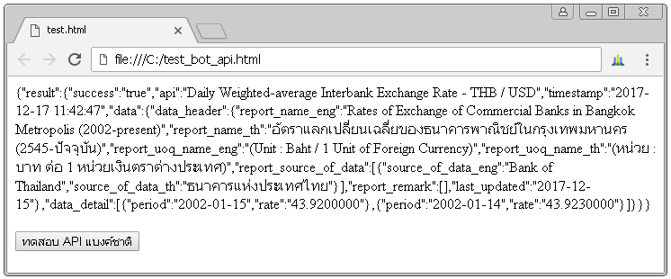

:fire: ... The project will be updated continuously ......  :fire:

# Trading example codes (not yet)

This repository collects my example codes in Python for studing in [The Stock Exchange of Thailand (SET)](http://www.set.or.th/set/mainpage.do) (__not yet__).

## Requirement

All examples are written in Python language, so you need to setup your environments as below. 

* First, install [ANACONDA](https://www.continuum.io/downloads).
* For Deep learning, I used 2 library including TensorFlow and Keras.

You can install TensorFlow from PyPI with the command.

`pip install tensorflow`

And you can also install Keras from PyPI with the command.

`pip install keras`

* Install pandas_datareader for getting data from [yahoo finance](https://finance.yahoo.com/) and also install fix_yahoo_finance (fix bugs).

`pip install pandas_datareader`

`pip install fix_yahoo_finance`

* Install googlefinance for getting data from [google finance](https://www.google.com/finance). 

`pip install  googlefinance`

* Install tqdm to make my loops show a smart progress meter on console

`pip install tqdm`

Download datasets (EOD data files from SET)

* http://siamchart.com/stock/

## My source codes

### 1) [BOT_API_example.py](BOT_API_example.py)

Since Bank of Thailand (BOT) has provided [21 APIs](https://iapi.bot.or.th/Developer?lang=th) for query data including Exchange rate, Interest Rate and Debt securities auction so I would like to show examples howto use 2 APIs such as
- Daily Weighted-average Interbank Exchange Rate - THB / USD
- Daily Average Exchange Rate - THB / Foreign Currency

For example codes in HTML+JavaScript, JavaScript with Node.js and Python, I shared at [here](https://gist.github.com/adminho/0159bb53c02bfdee1c4c31de3d8ecd92)

_An example when using "Daily Weighted-average Interbank Exchange Rate - THB / USD" API_

### 2) Datasets of [The Stock Exchange of Thailand (SET)](http://www.set.or.th/set/mainpage.do)

I use datasets from http://siamchart.com/stock/ that is a EOD file.

* [siamchart_csv.py](datasets/siamchart_csv.py) use convert the EOD file to stock csv files.
* [siamchart_csv2db.py](datasets/siamchart_csv2db.py) use convert the stock csv files to SQL database ([sqlite](https://docs.python.org/2/library/sqlite3.html)).
* [siamchart_csv2json.py](datasets/siamchart_csv2json.py) use convert the stock csv file to json files.

### 3) [indicator.py](indicator.py) 

There are my examples to compute the technical indicators for securities including

* [ROC](http://stockcharts.com/school/doku.php?id=chart_school:technical_indicators:rate_of_change_roc_and_momentum)
* [Bollinger Band (BBANDS)](http://stockcharts.com/school/doku.php?id=chart_school:technical_indicators:bollinger_bands)
* daily returns
* [SMA and EMA](http://stockcharts.com/school/doku.php?id=chart_school:technical_indicators:moving_averages)
* [MACD and signal](http://stockcharts.com/school/doku.php?id=chart_school:technical_indicators:moving_average_convergence_divergence_macd)
* [RSI](http://stockcharts.com/school/doku.php?id=chart_school:technical_indicators:relative_strength_index_rsi)
* [Sharpe ratio](http://www.investopedia.com/terms/s/sharperatio.asp?lgl=rira-baseline-vertical)
* [True Range (TR) and ATR](http://stockcharts.com/school/doku.php?id=chart_school:technical_indicators:average_true_range_atr)
* [Beta](http://www.investopedia.com/terms/b/beta.asp?lgl=rira-baseline-vertical)
* [K% and D%](http://stockcharts.com/school/doku.php?id=chart_school:technical_indicators:stochastic_oscillator_fast_slow_and_full)
* [OBV](http://stockcharts.com/school/doku.php?id=chart_school:technical_indicators:on_balance_volume_obv)
* compute gain 
* and etc

### 4) [LSTM_predict_trend.py](LSTM_predict_trend.py) 

I'm trying to apply Deep Learning (LSTM network) to predict a stock trend (not complete).

### 5) [CNN_predict_trend.py]() 

.... ✍ Pending

### 7) Deep Reinforcement Learning 

I'm trying to apply Deep Reinforcement Learning (Deep Q-learning) as stated in the paper [Playing Atari with Deep Reinforcement Learning](https://www.cs.toronto.edu/~vmnih/docs/dqn.pdf) to automatic trading  (work in progress)

* [DeepQ_trade.py](DeepQ_trade.py) is first version (not complete).
* [RL_trader](RL_trader.py) is second version that I borrowed some codes from https://github.com/cstorm125/rl_trader as Deep Q-learning for Bitcoin (not complete).

### 8) Example for get Data Stock on Colab

* [My example code at here](https://colab.research.google.com/drive/1XSE1DRLIUzLqfnfPvS4ZMbjZ2s20ub7V)

## Thank you

I Borrowed some codes from

* https://www.udacity.com/course/machine-learning-for-trading--ud501
* http://matplotlib.org/examples/pylab_examples/finance_demo.
* https://github.com/cstorm125/rl_trader

## Knowledge

* https://www.udacity.com/course/machine-learning-for-trading--ud501
* https://www.datacamp.com/community/tutorials/finance-python-trading
* [Playing Atari with Deep Reinforcement Learning](https://www.cs.toronto.edu/~vmnih/docs/dqn.pdf)
